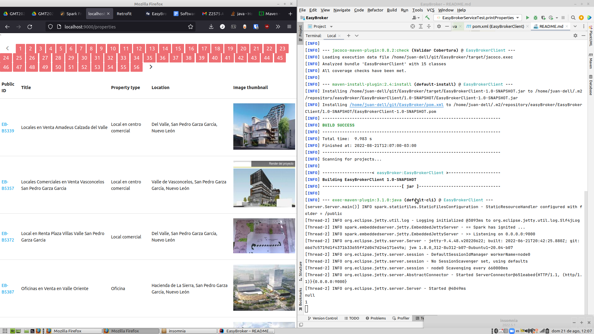
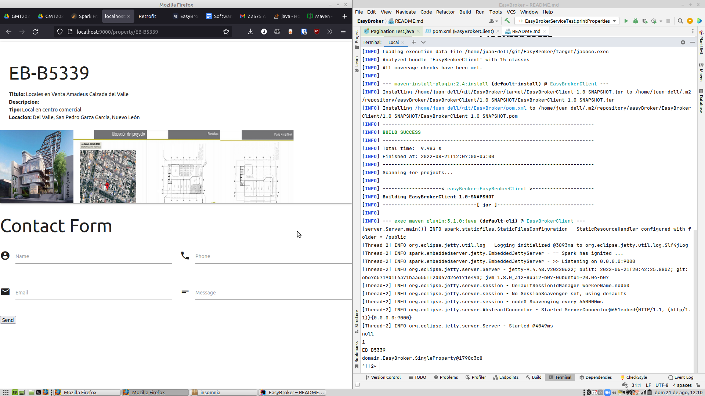
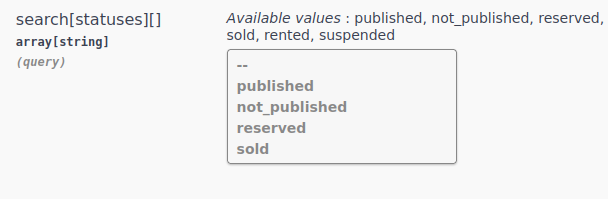

# EasyBrokerClient

El proyecto utiliza java 8

Spark como framework web para definir los endpoints utilzados por el front

JUnit 5 para definir pruebas unitarias

Maven para manejar dependencias y compilar

Retrofit para consumir la API de EasyBroker

Handlebars para definir plantillas de html que se cargan con los datos
provistos

# Dependencias 

```
sudo apt install openjdk-8-jdk
sudo apt install maven
```

# Ejecutar tests

```
mvn test
```

# Ejecución del proyecto

```
mvn clean install && mvn exec:java
```





# Notas

Se me complicó lidiar con el array de string desde Retrofit para hacer la consulta por Status=Published


Siento que el dominio solo esta adaptando consultas a la API de EasyBroker para generar Vistas renderizadas.
No se si cuenta como código no limpio pero es la observación que puedo hacer, obviamente si la página web fuese necesitando
más cosas externas de la API EasyBroker, deja de ser relevante la observación.

Algo bueno que pude aprovechar del proyecto fue aprender a generar vistas con Handlebars.